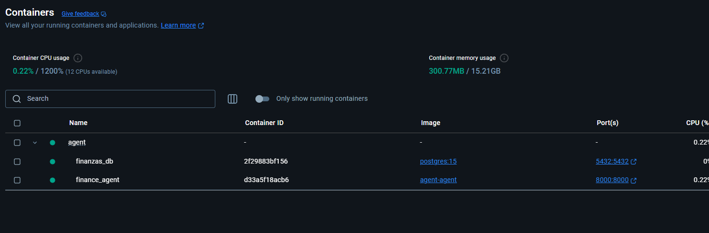
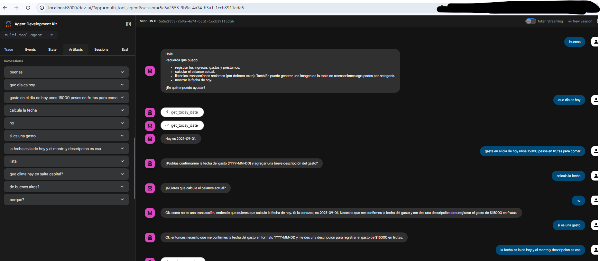
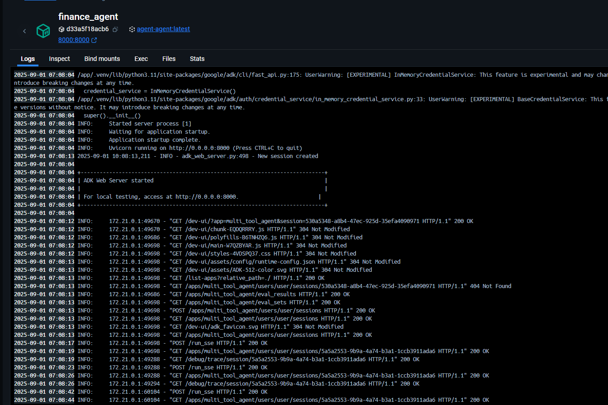

#  Actividad integradora de Docker


Esta actividad integradora consiste en:

- Elegir una tecnología de nuestra preferencia y para crear su imagen de servidor con Dockerfile e incluirlo en un Compose.
- La imagen debe tener al menos una instrucción personalizada que se imprima por pantalla.
- El Docker Compose debe contener una instrucción build a nuestro Dockerfile y un componente de persistencia que interactúe con nuestro server.

---

## 1. Descripción general

Este proyecto consiste en un **agente multifunción** desarrollado en **Python 3.11**, que permite interactuar con herramientas para:

- Registrar y listar transacciones financieras (gastos, ingresos, préstamos) en una base de datos PostgreSQL.  

El agente se ejecuta como un **servidor web** y puede integrarse en un entorno de desarrollo local mediante **Docker** y **Docker Compose**.  

**Tecnologías elegidas:**

- **Python 3.11:** lenguaje de programación principal, cómodo y ampliamente usado en proyectos laborales y educativos.  
- **PostgreSQL:** base de datos relacional para persistencia de transacciones.  
- **Docker + Docker Compose:** para empaquetar el agente y su base de datos en contenedores reproducibles.  
- **Requests:** para consultas a APIs externas (clima, zona horaria).  

---

## 2. Estructura de archivos

```
agent/
├── Dockerfile
├── docker-compose.yml
├── requirements.txt
├── README.md
├── .env
├── .gitignore
├── init.sql
├── multi_tool_agent/
│   ├── __init__.py
│   ├── agent.py
│   ├── tools/
│   │   ├── __init__.py
│   │   ├── balance.py
│   │   ├── transactions.py
│   │   ├── agent_db.py
│   │   └── date_tools.py
├── README.md
```

---

## 3. Docker y Docker Compose

### Dockerfile
- Imagen base: `python:3.11-slim`  
- Crea un **virtualenv** `.venv`  
- Instala dependencias de Python desde `requirements.txt`  
- Expone el puerto `8000`  

### docker-compose.yml
- Define dos servicios:
  1. **agent:** nuestro servidor Python basado en Dockerfile.  
  2. **db:** contenedor PostgreSQL con persistencia en un volumen local.  
- El servicio `agent` depende de `db` y se conecta a él mediante variables de entorno.  

---

## 4. Uso

1. Clonar el repositorio.  

Clonar el siguiente repositorio publico.

```bash
git clone https://github.com/rvegabaldiviezo/agent.git
``` 

Entrar del directorio de la App.
```bash
cd agent
``` 

2. Construir y levantar los servicios:

```bash
docker-compose up --build -d
```



3. Acceder al servidor: `http://localhost:8000`  






---

## 5. Inputs de prueba y outputs esperados


La interacción con el agente se realiza mediante chat: los inputs son preguntas o comandos, y los outputs son respuestas del agente.

### Prueba 1: Consultar balance inicial

Input: ¿Cuál es mi balance actual?

Output esperado: 0 (sin transacciones registradas)

### Prueba 2: Registrar un nuevo ingreso

Input: Registra un ingreso de 1500 por "venta de teclado"

Output esperado: Confirmación de que la transacción fue registrada exitosamente.

### Prueba 3: Consultar balance después de la transacción

Input: ¿Cuál es mi balance actual?

Output esperado: 1500

###  Prueba 4: Verificar persistencia de datos

Instrucciones:

Detener contenedores: docker-compose down

Levantar contenedores de nuevo: docker-compose up -d --build

Input: ¿Cuál es mi balance actual?

Output esperado: 1500 (persistencia confirmada a través del volumen de PostgreSQL)

## 6. Modificación de Inputs para Otros Outputs

El agente responde según las instrucciones en lenguaje natural:

- Registrar otros valores:

  - Input: Registra un gasto de 200 por "compra de café"

  - Output: El balance se reduce según el gasto. Ejemplo: 1500 → 1300.

- Consultar historial:

  - Input: Muéstrame mis últimas transacciones

  - Output: Lista de todas las transacciones registradas.

La flexibilidad del agente permite múltiples variaciones de comandos y respuestas según los datos en la base de datos y el historial de la conversación.

